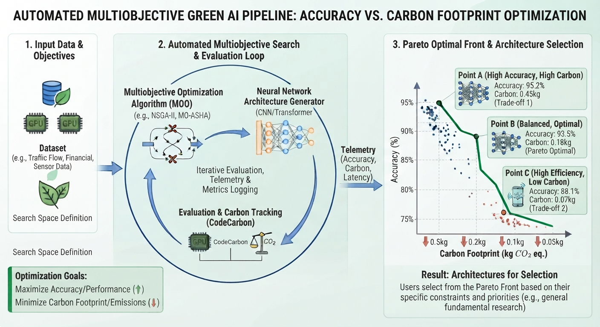
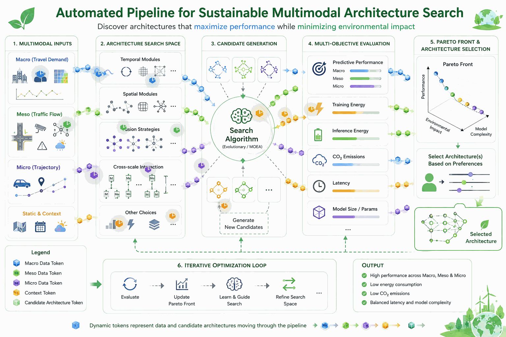
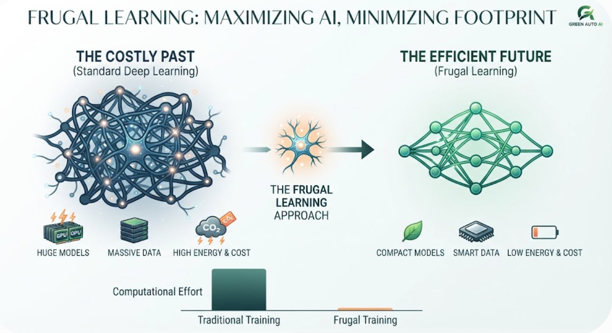
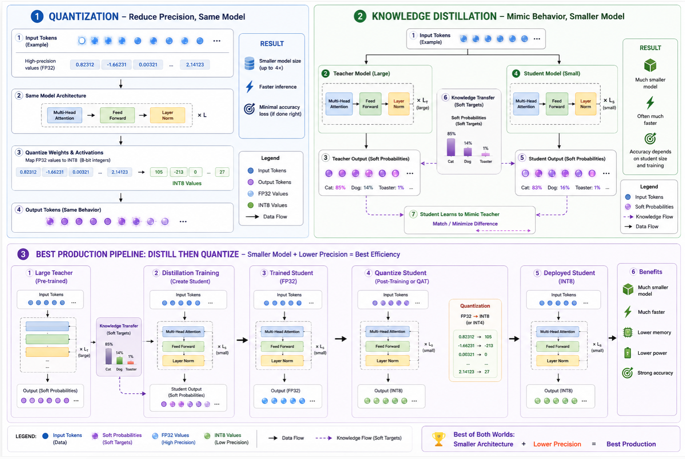

<div align="center">

<h1 style="margin-bottom: 0;">🌿 Multiobjective Green AI & Automated Deep Learning</h1>
<h3><em>Maximizing Deep Learning Performance While Minimizing Carbon Footprint</em></h3>

<p>
  <a href="https://opensource.org/licenses/MIT"></a>
  <a href="https://www.python.org/downloads/"></a>
  <a href="https://codecarbon.io/"></a>
  <a href="https://github.com/phamdps/greenmoo/graphs/commit-activity"></a>
</p>

<p><em>Developing automated deep learning tools using multi-objective optimization algorithms to explore neural network architectures that balance high accuracy with minimal environmental footprint.</em></p>

</div>

## 💡 What is Green AI & Frugal AI?

Modern Artificial Intelligence models and search algorithms require vast computational resources, which translates directly to high energy consumption and carbon emissions.

* **Green AI:** Focuses on computational efficiency as a primary metric alongside accuracy, explicitly targeting the reduction of energy footprints and carbon emissions in AI research and deployment.
* **Frugal AI:** Emphasizes resource efficiency—achieving high performance using smaller datasets, lighter models, and fewer GPU hours.
* **Multiobjective Optimization (MOO):** Combines these principles into an automated framework that explores Pareto-optimal trade-offs between accuracy and carbon emissions.

---

## 🛠️ Technology Stack & Tools

* **Python:** Core programming language.
* **Multi-Objective Optimization Algorithms:** Algorithms designed to navigate the Pareto frontier (balancing accuracy vs. emissions).
* **CodeCarbon:** Lightweight Python package designed to estimate carbon dioxide ($CO_2$) emissions produced during hardware execution.
* **Deep Learning Frameworks:** PyTorch, TensorFlow, and automated neural network architecture exploration tools.

---

## 📊 Multiobjective Trade-off & Pareto Front

**Figure 1.** The automated pipeline evaluates multiple network configurations to discover architectures that maximize performance while minimizing environmental impact:

<p align="center">
  
</p>

---

## 🚀 Quickstart

### 1. Prerequisites & Installation

Clone this repository and install the dependencies:

```bash
git clone [https://github.com/phamdps/greenmoo.git](https://github.com/phamdps/greenmoo.git)
cd greenmoo
pip install -r requirements.txt

```

---

### 2. Usage Examples

#### Option A: Tracking Carbon Footprint During Search/Training

```python
from codecarbon import EmissionsTracker
import time

# Initialize the tracker for your optimization loop
tracker = EmissionsTracker(
    project_name="Multiobjective_Green_AI_Search",
    output_dir="./emissions"
)

tracker.start()

try:
    # --- Multiobjective Architecture Search / Training Loop ---
    print("Exploring neural architectures sustainably...")
    time.sleep(5)  # Simulating search step
finally:
    emissions: float = tracker.stop()
    print(f"Estimated search emissions: {emissions:.6f} kg CO2eq")

```

#### Option B: Using the `@track_emissions` Decorator

```python
from codecarbon import track_emissions

@track_emissions(project_name="moo_architecture_evaluation")
def evaluate_architecture():
    # Model evaluation and carbon tracking logic
    pass

if __name__ == "__main__":
    evaluate_architecture()

```

---

## 📊 Monitoring & Pareto Optimization Metrics

When executing search iterations, the framework records telemetry to build your optimization dashboard:

* **`accuracy` / `performance**`: Primary objective to maximize.
* **`emissions` / `carbon_footprint**`: Environmental impact metric ($kg \ CO_2eq$) to minimize.
* **`energy_consumed`**: Total hardware power draw in kWh.
* **`duration`**: Search or training execution duration.

---

## 🌿 Automated Sustainable Multimodal Architecture Search

The proposed framework automatically explores and evaluates multimodal neural network architectures for transportation digital twin prediction across **Macro (travel demand), Meso (traffic flow), and Micro (vehicle trajectory)** levels. The architecture search process jointly considers predictive performance and computational/environmental objectives, including training energy, inference energy, CO₂ emissions, latency, and model complexity, to identify Pareto-optimal architectures that provide an effective balance between predictive capability and environmental sustainability.



**Figure 2.** Overview of the automated architecture-search pipeline. Multimodal transportation data are first represented across macro, meso, micro, and contextual levels. The framework then explores a configurable architecture search space covering temporal modules, spatial modules, multimodal fusion strategies, and cross-scale interactions. Candidate architectures are generated and evaluated according to multiple objectives, after which Pareto optimization identifies architectures that achieve favorable trade-offs between prediction performance and environmental impact. The optimization process iteratively updates and refines the search space, enabling the discovery of efficient architectures for sustainable transportation digital twin prediction.

---

## 🌱 Best Practices for Green Neural Architecture Search

1. **Pareto-Driven Selection:** Avoid over-provisioning model capacity if a smaller architecture yields marginal accuracy gains at a massive energy cost.
2. **Early Stopping on Inefficient Trails:** Terminate architecture trials early if their carbon-to-accuracy ratio falls outside acceptable thresholds.
3. **Data Efficiency:** Leverage transfer learning and structured search spaces to minimize redundant training steps.

---

## 🧠 Neural Architecture Growth for Frugal Learning

Deep learning has achieved incredible breakthroughs across a wide range of fields—from machine translation and image recognition to high-end text generation and complex time series forecasting. However, these successes come at a massive price, demanding enormous computational time, energy, and financial costs to train gigantic neural network architectures. **Frugal AI** takes the opposite approach, focusing on training models with as few data samples or as little computational power as possible (often called **Green AI**).

While large neural networks are generally easier to optimize and yield better performance, they suffer from high internal redundancy. Although compression techniques can shrink these massive models down for edge devices—like running real-time video processing on a laptop—going to the opposite extreme with "tiny" models often leads to a lack of expressivity, preventing them from fitting complex data accurately.

<p align="center">
  
</p>

To overcome this trade-off, it usually starts with a simplest possible network, and grows it dynamically during training. By using backpropagation feedback to identify and target learning bottlenecks, we can add neurons or layers or blocks precisely where and when they are needed. This iterative architecture refinement dramatically streamlines Automated Deep Learning (AutoDL), replacing trial-and-error search methods with a single, highly efficient training session.

---

## 🌱 Conceptual Framework: An Incremental Multimodal Neural Architecture Growth For Frugal Learning


Frugal AI focuses on building **accurate, adaptive, and computationally efficient AI systems** by using only the capacity and resources that are actually needed. Instead of starting with a large architecture and searching for the best configuration through expensive trial and error, our approach starts with a lightweight model and **grows the current architecture incrementally** when an expressivity bottleneck is detected.

For transportation digital twins, multimodal information from **Macro (travel demand), Meso (traffic flow), and Micro (vehicle trajectories)** is transformed into dynamic tokens and processed through a continuously evolving neural architecture. An **RL-driven growth mechanism** decides when, where, and how much capacity to add, while evaluating the trade-off between predictive performance, computational cost, and **CO₂ emissions**.

The ultimate goal is to **learn more with less**: high-quality predictions, minimal unnecessary parameters and computation, and architectures that can adapt efficiently from edge-friendly small models to conditional systems such as **Mixture-of-Experts**.

## Quantization vs Distillation



It is important to note that neither quantization nor distillation constitutes Neural Architecture Search (NAS) or network growth. While architectural methods dynamically discover or expand network layouts to boost capacity or performance, both quantization and distillation operate on pre-existing structures. Distillation compresses a model by transferring knowledge into a predefined, smaller student architecture, whereas quantization merely truncates the numerical precision of an existing network's weights without altering its structural wiring at all.

### Special Consideration for (Green Frugal AI)

Combining these methods drastically lowers the carbon footprint and energy draw of running continuous digital twin simulations. However, keep an eye on **catastrophic forgetting** in *continual learning*. Since quantizing or distilling a model too aggressively can sometimes degrade its plasticity, making it harder for the model to adapt to newly introduced traffic patterns or road layouts.

## 📜 License

GreenMOO is open-source software released under the **GNU General Public License (GPL-3.0)** - see the [LICENSE](https://www.google.com/search?q=LICENSE) file for details.

---

## 🤝 Contributing

Contributions, issues, and feature requests are welcome! Check out the [issues page](https://www.google.com/search?q=https://github.com/phamdps/greenmoo/issues).

